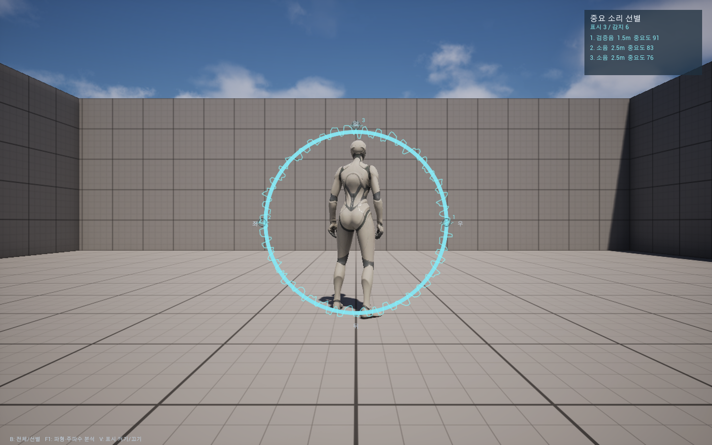

# SoundCompass

게임공학 프로젝트의 **동시 발생 소리의 중요도 선별 시각화** 기능입니다. Unreal Engine **5.8**에서 실행합니다.

`main`의 실험 맵을 기반으로 구현하고 `AHNINTAE`의 원본 마커·아이콘·머티리얼을 연결했습니다. **캐릭터 중심 원형 파형**이 실제 출력 소리에 반응하며, 선택된 소리의 방향 아이콘이 원 위에 표시됩니다.

## 실행

`SoundCompass.uproject`를 열고 기존 `ThirdPerson/Lvl_ThirdPerson` 맵에서 **Play**를 누릅니다. 처음 열 때 C++ 모듈을 재빌드합니다.

| 키 | 기능 |
| --- | --- |
| **B** | 중요 소리 선별 ↔ 전체 소리 표시 |
| **F1** | 파형·주파수·후보 소리 분석 화면 |
| **V** | 시각화 전체 켜기/끄기 |

기본 설정은 **중요도 0.50 이상, 상위 3개**입니다. 종류별 중요도에 거리·크기를 반영하며, 큰 환경음보다 조용한 위험 소리를 우선할 수 있습니다. 원형 파형은 실제 전체 출력의 파형이고, 아이콘은 개별 소리의 중요도·방향 데이터입니다.

[기능·설정·UI 연결·실험 비교·검증 안내](Docs/SOUND_VISUALIZATION_KO.md)

UE 5.8.2 / Mac에서 빌드 및 실제 맵 실행 검증을 통과했습니다. 신호·중요도 계산 테스트 47개도 통과했습니다. Windows 빌드는 별도로 확인해야 합니다.

음원 출처는 [기존 음원 크레딧](Content/SoundTest/CREDITS.md)을 참고하세요.
